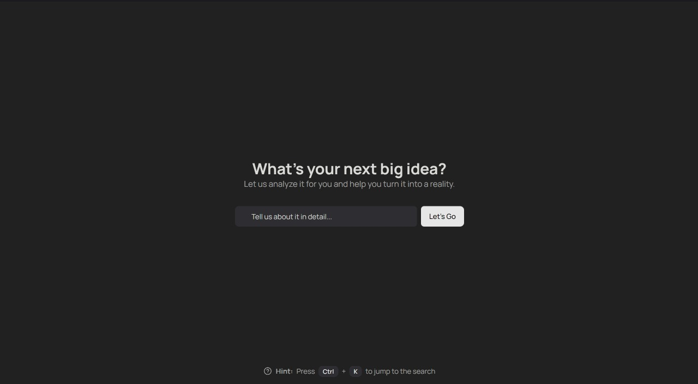
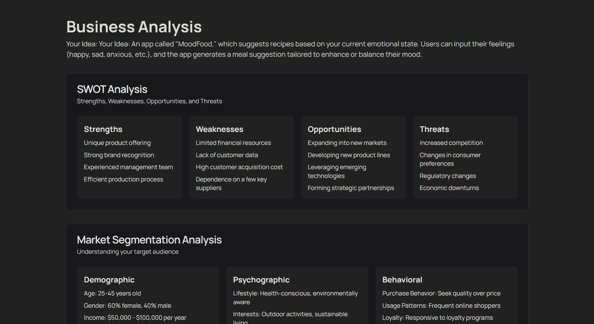

<h1 align="center">The SWOT Spot</h1>

<p align="center">
	<a href="https://github.com/YashitaCodes/swot-spot/blob/main/README.md"></a>
	<a href="#license"></a>
	<a href="https://github.com/YashitaCodes/swot-spot/issues"></a>
	<a href="https://snyk.io/test/github/YashitaCodes/swot-spot?targetFile=package.json"></a>
</p>


</img>

<p align="center" style="padding-top: 10px;">
	
	
	
	
	
	
	
	
</p>

**The SWOT Spot** is an AI-powered solution designed to streamline the ideation process for businesses by generating key analyses based on user input. Users can enter their business concepts, and the tool automatically produces comprehensive analyses, including:

- **SWOT Analysis**
- **Market Segmentation**
- **Competitor Analysis**
- **Value Proposition Canvas**
- **Risk Analysis**

Presented in a clear and concise format, this solution offers startups and small businesses actionable insights into their strengths, market positioning, competition, and potential risks, facilitating efficient decision-making without the complexity of traditional methods.

## 🚀 Features

- **AI-Powered Insights**: Utilizes the latest LLaMA 3 model for generating in-depth analyses.
- **User-Friendly Interface**: Designed with Next.js and Tailwind CSS for a responsive and intuitive user experience.
- **Real-Time Processing**: Quickly generates reports based on user input, allowing for fast decision-making.
- **Comprehensive Reports**: Provides a complete set of analyses to aid in strategic planning and business development.

## ⚙️ Technologies Used

- **Frontend**: Next.js, Tailwind CSS, TypeScript, and ShadCN for a modern UI.
- **AI Model**: Groq API leveraging the LLaMA 3 (8B, 8192) model for natural language processing.
- **Routing**: Utilizes the NextJS app router.
- **Hosting**: Deployed on Vercel for fast and reliable performance.

## 🌐 Live Demo

You can view the live version of The SWOT Spot at [swotspot.yashita.live](https://swotspot.yashita.live).



## 📥 Installation

To run The SWOT Spot locally, follow these steps:

1. **Clone the Repository**:

   ```bash
   git clone https://github.com/YashitaCodes/swot-spot.git
   ```

2. **Navigate to the Project Directory**:

   ```bash
   cd swot-spot
   ```

3. **Install Dependencies**:

   ```bash
   npm install
   ```

4. **Create a `.env` File**:
   - Create a file named `.env.local` in the root directory of the project.

5. **Add Your API Key**:
   - Go to [Groq Console](https://console.groq.com/keys) to generate your API key.
   - Add the following line to your `.env.local` file, replacing `YOUR_API_KEY` with your actual API key:

     ```plaintext
     NEXT_GROQ_API_KEY=YOUR_API_KEY
     ```

6. **Run the Development Server**:

   ```bash
   npm run dev
   ```

7. **Access the Application**:
   - Open your browser and navigate to `http://localhost:3000`.

## 📋 Usage

1. **Input Your Business Concept**: Start by entering a brief description of your business idea.
2. **Generate Analyses**: Click the 'Generate' button to create your SWOT, Market Segmentation, Competitor, Value Proposition Canvas, and Risk analyses.
3. **Review Insights**: The analyses will be displayed in a clear and organized format, ready for you to use in your strategic planning.

## 🤝 Contributing

Contributions are welcome! If you would like to improve The SWOT Spot, please fork the repository and submit a pull request. 

### Steps to Contribute:

1. Fork the project.
2. Create your feature branch (`git checkout -b feature/AmazingFeature`).
3. Commit your changes (`git commit -m 'Add some AmazingFeature'`).
4. Push to the branch (`git push origin feature/AmazingFeature`).
5. Open a pull request.

## 📝 License

This project is licensed under the MIT License - see the [LICENSE](LICENSE.md) file for details.

